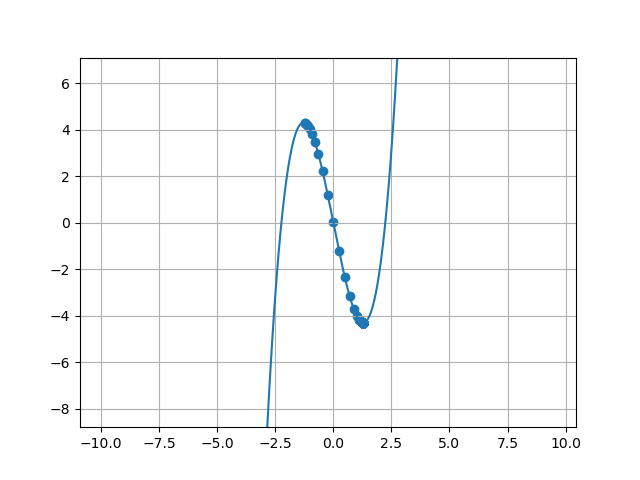

# Gradient Descent

Gradient descent using the equation y = x^3 - 5x

200 iterations - each time uses the slope of y = x^3 - 5x to calculate the next x-value. 
Depending on the starting x-value it will either reach the local minimum or negative infinity.
